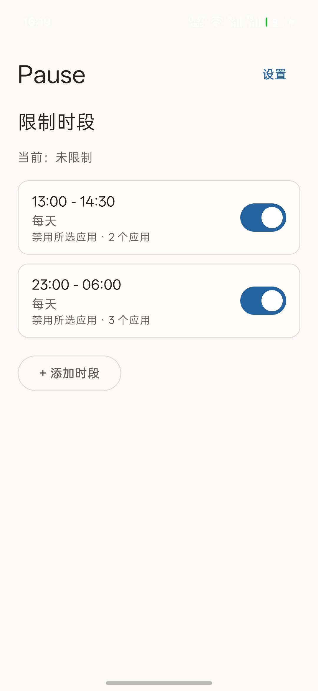
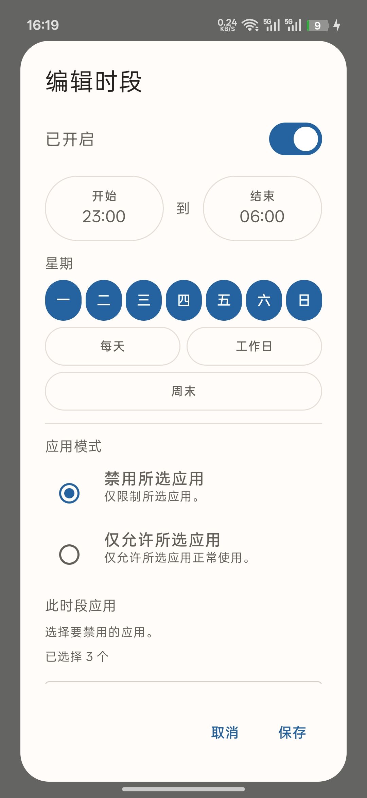
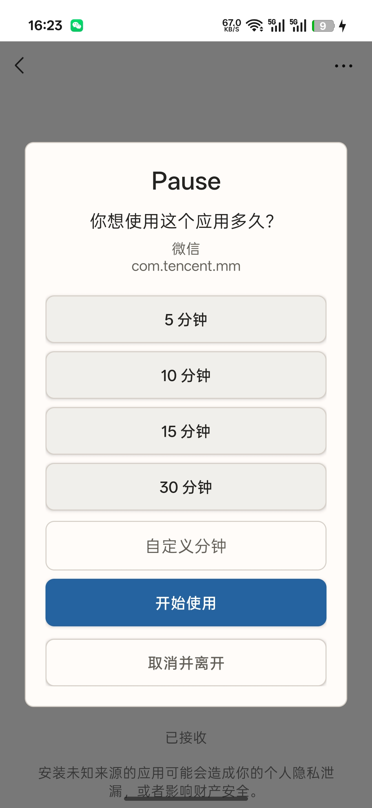
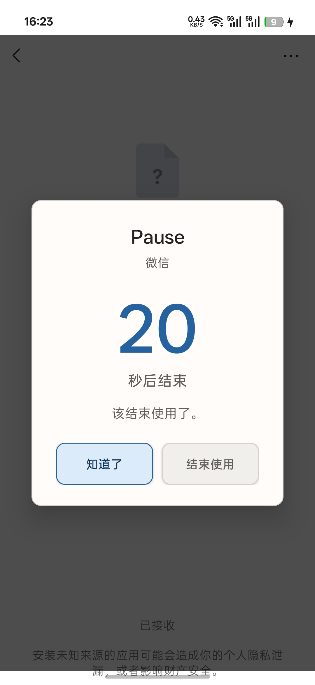

# Pause

Take a moment before you continue.

[English](#english) | [简体中文](#简体中文)

## English

### Overview

Pause is a lightweight Android app designed to reduce mindless app usage by introducing intentional pauses and scheduled restrictions. You can define restriction schedules, choose which apps are affected during each schedule, and give yourself a short, deliberate usage window when you open a restricted app.

### Features

- Multiple restriction schedules
- Weekday selection
- Overnight schedules such as `22:30-07:00`
- Per-schedule app rules
- Block selected apps mode
- Allow selected apps only mode
- Searchable app selection
- Accessibility-based foreground app detection
- Usage-duration prompt when opening a restricted app
- Preset and custom session durations
- Per-app independent usage sessions
- Ongoing countdown notification
- Configurable final warning at 10 / 20 / 30 seconds
- Optional vibration
- Automatic return to Home when a session expires while the restricted app is foreground
- Light / Dark / Follow system theme
- English / Simplified Chinese / Follow system language
- Accessibility permission state detection and warning
- Settings reset
- Android 12+ branded splash screen

### How It Works

1. Create a restriction schedule.
2. Choose either Block selected apps or Allow selected apps only.
3. Select the apps for that schedule.
4. Enable Accessibility access for Pause.
5. During an active schedule, opening a restricted app triggers Pause.
6. Choose a temporary usage duration.
7. Pause warns before expiry and ends the session when the countdown reaches zero.

Pause uses an Android AccessibilityService to detect foreground apps and display restriction overlays. The service is used for the app restriction flow; it is not a general-purpose automation tool.

### Permissions

Pause uses the following Android permissions and system access:

- Accessibility Service: needed to detect when a restricted app enters the foreground and to show the usage prompt/final warning overlay.
- Notifications: needed to show the ongoing countdown for active usage sessions.
- Vibration: used only when warning vibration is enabled.

Pause does not require `SYSTEM_ALERT_WINDOW` / Draw over other apps permission because restriction overlays are shown with `TYPE_ACCESSIBILITY_OVERLAY` from the enabled AccessibilityService.

### Installation

Download the signed APK from the GitHub Releases page for `Xia92/Pause`.

Do not commit APK files into the Git repository. Release APKs should be distributed through GitHub Releases or another release channel.

On Android devices, especially ColorOS / OPPO devices, sideloaded apps may require manual approval before Accessibility access can be enabled. If Pause appears enabled in the app but does not respond, check Android's Accessibility settings and enable the Pause service there.

### Requirements

- Android `minSdk`: 24
- Android `targetSdk`: 37
- Application ID: `io.github.xia92.pause`

### Version

Current release: `v0.1.0`

### Development Status

Pause is an early personal/open-source project. It may still contain device-specific issues, especially because Android OEMs can manage Accessibility Services differently.

### Screenshots / 截图

  
  
  
  

### License

License information will be added separately.

## 简体中文

稍作停留

### 概览

Pause 是一个轻量级 Android 应用，用来减少无意识地打开和停留在应用里的情况。你可以设置限制时段，为每个时段选择不同的应用规则，并在打开受限制应用时先经过一次有意识的暂停。

### 功能

- 多个限制时段
- 按星期选择生效日期
- 支持跨夜限制时段，例如 `22:30-07:00`
- 每个限制时段都有独立的应用规则
- 禁用所选应用模式
- 仅允许所选应用模式
- 可搜索的应用选择
- 基于无障碍服务识别前台应用
- 打开受限制应用时显示使用时长提示
- 预设和自定义使用时长
- 每个应用独立的使用会话
- 持续显示的倒计时通知
- 可配置 10 / 20 / 30 秒最终提醒
- 可选震动提醒
- 当受限制应用在前台且使用时长结束时，自动返回主页
- 浅色 / 深色 / 跟随系统外观
- English / 简体中文 / 跟随系统语言
- 无障碍服务状态检测和提醒
- 重置设置
- Android 12+ 品牌启动页

### 工作方式

1. 创建一个限制时段。
2. 选择禁用所选应用或仅允许所选应用。
3. 为这个限制时段选择应用。
4. 在系统设置中开启 Pause 的无障碍服务。
5. 在限制时段生效时，打开受限制应用会触发 Pause。
6. 选择一个临时使用时长。
7. Pause 会在结束前显示最终提醒，并在倒计时归零时结束本次使用。

Pause 使用 Android 无障碍服务来识别前台应用并显示限制提示层。这个服务用于应用限制流程，不是通用自动化工具。

### 权限

Pause 会使用以下 Android 权限和系统能力：

- 无障碍服务：用于识别受限制应用是否进入前台，并显示使用时长提示和最终提醒。
- 通知：用于显示正在进行的使用会话倒计时。
- 震动：仅在开启震动提醒时使用。

Pause 不需要 `SYSTEM_ALERT_WINDOW` / 悬浮窗权限，因为限制提示层通过已启用无障碍服务提供的 `TYPE_ACCESSIBILITY_OVERLAY` 显示。

### 安装

请从 `Xia92/Pause` 的 GitHub Releases 页面下载已签名 APK。

不要把 APK 文件提交到 Git 仓库中。发布 APK 应通过 GitHub Releases 或其他发布渠道分发。

在 Android 设备上，尤其是 ColorOS / OPPO 设备，侧载安装的应用可能需要用户手动允许无障碍服务。如果 Pause 应用内显示已开启但实际没有响应，请进入 Android 的无障碍设置，确认 Pause 服务已被系统启用。

### 要求

- Android `minSdk`: 24
- Android `targetSdk`: 37
- Application ID: `io.github.xia92.pause`

### 版本

当前版本：`v0.1.0`

### 开发状态

Pause 目前是一个早期的个人开源项目。由于不同 Android 厂商对无障碍服务的管理方式可能不同，应用仍可能存在设备相关问题。

### Screenshots / 截图

  
  
  
  

### 许可证

License information will be added separately.
